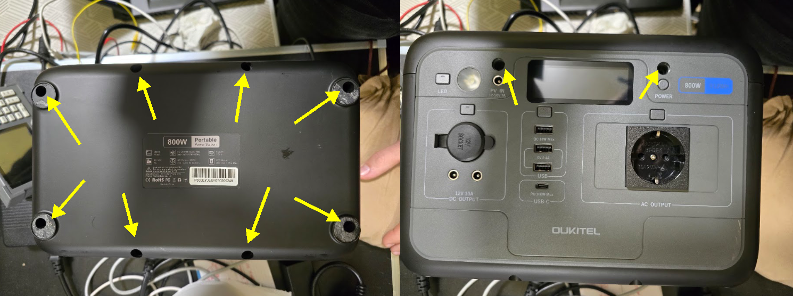
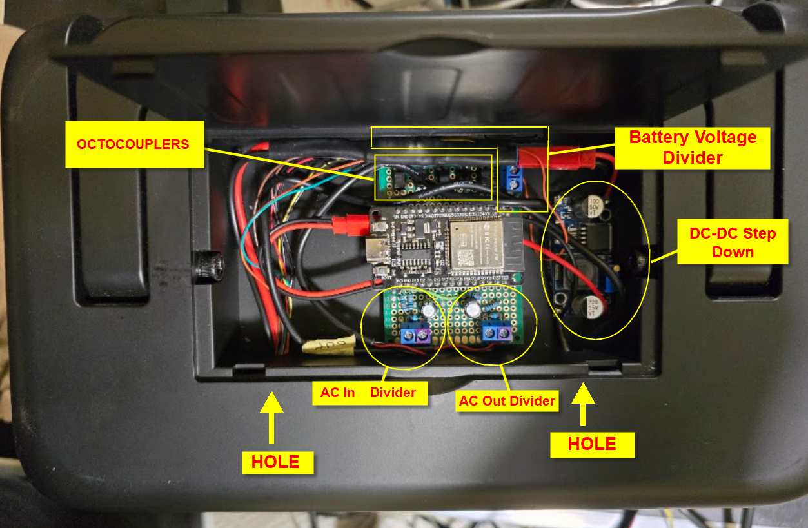

# Oukitel P800E Smart Controller

[](https://github.com/yourusername/oukitel-p800e-smart-controller)
[](LICENSE)
[](https://www.espressif.com/en/products/socs/esp32)

Advanced ESP32 firmware designed to transform the Oukitel P800E Power Station into a smart, network-connected device. This project provides remote monitoring, web-based control, home automation integration (Home Assistant, MQTT), and advanced UPS functionalities for safe shutdown of connected devices.

---

## 📋 Table of Contents

- [Key Features](#-key-features)
- [Hardware Requirements](#-hardware-requirements)
- [Wiring Guide](#-wiring-guide)
- [Software Installation](#-software-installation)
- [Initial Configuration](#-initial-configuration)
- [Web Interface Guide](#-web-interface-guide)
- [Calibration Guide](./CALIBRATION.md)
- [Integration Examples](./INTEGRATION.md)
- [API Documentation](./API.md)
- [Advanced Features](#-advanced-features)
- [Troubleshooting](./TROUBLESHOOTING.md)
- [Contributing](#-contributing)
- [License](#-license)

---

---

## 🚀 Key Features

### Core Functionality
- **📊 Real-time Monitoring**: Live dashboard showing voltage, current (In/Out), power consumption, battery state of charge (SoC), and runtime estimates
- **🌐 Responsive Web Dashboard**: Modern, mobile-friendly web interface accessible from any device
- **🔌 Remote Control**: Turn USB, DC, AC outputs, and flashlight on/off via WiFi
- **⚡ Energy Management**: Track daily/monthly consumption with 12-month history
- **🔋 Battery Management**: Advanced battery monitoring with low/critical voltage warnings and automatic shutdown

### Home Automation
- **🏠 Home Assistant Integration**: Native integration with automatic MQTT discovery for seamless setup
- **📡 MQTT Support**: Full MQTT client support for integration with any home automation system
- **🔔 HTTP Notifications**: Configurable HTTP shutdown notifications for custom integrations

### UPS Functionality
- **🖥️ NUT Protocol (Network UPS Tools)**: Emulates a standard UPS server compatible with:
  - Synology NAS (DSM)
  - QNAP NAS
  - Linux/Unix systems with NUT client
  - Windows with NUT client
- **🛡️ Safe Shutdown**: Automatic shutdown of connected devices at critical battery thresholds
- **📊 UPS Status Reporting**: Real-time battery status, voltage, and load information

### Advanced Features
- **🌅 Auto Power On**: Automatically power on AC Output when the powerstation is on
- **📝 Data Logging**: Persistent logging of sensor data and events
- **🔧 Advanced Calibration**: Fine-tune sensor readings for maximum accuracy
- **📊 Log Levels**: Configurable logging system (DEBUG, INFO, WARNING, ERROR, NONE)

---

## 🛠 Hardware Requirements

### Essential Components

| Component | Specification | Quantity | Notes |
|-----------|--------------|----------|-------|
| **Microcontroller** | ESP32 DevKit V1 (or compatible) | 1 | ESP32-WROOM-32D recommended |
| **Current Sensors** | SCT013-100A (split-core current transformer) | 2 | One for input, one for output |
| **Burden Resistors** | 22Ω (or 33Ω) | 2 | One per SCT013 sensor |
| **Pull-up Resistors** | 100kΩ | 2 | One per SCT013 sensor (to 3.3V) |
| **Bias Resistors** | 100kΩ | 2 | One per SCT013 sensor (between nodes) |
| **Filter Capacitors** | 10µF (electrolytic or ceramic) | 2 | One per SCT013 sensor |
| **Voltage Divider** | Custom resistive divider or 0-25V module | 1 | For battery voltage (0-30V range) |
| **Voltage Divider Resistors** | 220kΩ, 27kΩ (1% tolerance) | 2 | For battery voltage divider |
| **Optocouplers** | PC817 or similar (4-pin) | 5 | For button control isolation |
| **Optocoupler Resistors** | 220Ω | 5 | One per optocoupler LED |
| **Power Supply** | Step-down converter 24V→5V | 1 | To power ESP32 from battery |
| **Power Station** | Oukitel P800E | 1 | Target device |

### Optional Components

- **Enclosure**: Weatherproof box for outdoor installations
- **Fuses**: Protection fuses for power lines
- **Terminal Blocks**: For secure wire connections
- **Heat Shrink Tubing**: For wire protection

### Tools Required

- Soldering iron and solder
- Multimeter
- Wire strippers
- Screwdrivers
- Breadboard

---

## 🔧 Disassembly

1. Remove the pads on the bottom of the power station.  
2. Remove the screws as shown in the image below.  
3. Slide off the top cover.



## 🔌 Wiring Guide

### Overview

The ESP32 interfaces with the Oukitel P800E through:
1. **Current Sensors (SCT013)**: Clamp around power cables to measure current
2. **Voltage Divider**: Connected to battery terminals to measure voltage
3. **Optocouplers**: Isolated connections to physical buttons for remote control

### Complete Pin Mapping

| ESP32 Pin | Component | Function | Notes |
|-----------|-----------|----------|-------|
| **GPIO 18** | Optocoupler → Power Button | Unit power ON/OFF | Long press (3s) simulation |
| **GPIO 16** | Optocoupler → USB Button | USB output control | Toggle on/off |
| **GPIO 17** | Optocoupler → DC Button | 12V DC output control | Toggle on/off |
| **GPIO 19** | Optocoupler → Flashlight Button | Torch control | Toggle on/off |
| **GPIO 21** | Optocoupler → AC Button | AC Inverter control | Toggle on/off |
| **GPIO 34** | SCT013 (Input) | Input current measurement | ADC1_CH6 (input only) |
| **GPIO 35** | SCT013 (Output) | Output current measurement | ADC1_CH7 (input only) |
| **GPIO 36** | Voltage Divider | Battery voltage reading | ADC1_CH0 (input only) |
| **5V** | Step-down converter output | ESP32 power supply | 3A minimum |
| **GND** | Common ground | Ground reference | Connect all grounds |

### Detailed Wiring Instructions

#### 1. Current Sensors (SCT013)

The SCT013 sensors require a conditioning circuit to convert the current transformer output to a voltage readable by the ESP32 ADC.

**Circuit Components (per sensor):**
- SCT013 current transformer (split-core)
- Burden resistor: 22Ω (or similar, typically 22-33Ω)
- Pull-up resistor: 100kΩ (to 3.3V)
- Bias resistor: 100kΩ (between nodes)
- Filter capacitor: 10µF (electrolytic or ceramic)
- Connection to ESP32 GPIO (GPIO34 for Input, GPIO35 for Output)

**Physical Connections:**

1. **SCT013 Wires**: The two wires from the SCT013 clamp come to your breadboard/protoboard

2. **Burden Resistor (22Ω)**: 
   - Connect one end to one SCT013 wire
   - Connect the other end to the second SCT013 wire
   - The burden resistor is in parallel with the SCT013 output

3. **Define Nodes**:
   - **Node A**: Junction where burden resistor, first SCT wire, and other components connect
   - **Node B**: Other side of burden resistor, second SCT wire, connected to GND

4. **From Node A**:
   - Wire to ESP32 GPIO34 (Input sensor) or GPIO35 (Output sensor) - this is the signal
   - 100kΩ resistor to ESP32 3.3V (pull-up)
   - Positive terminal (anode) of 10µF capacitor
   - 100kΩ resistor to Node B (bias resistor)

5. **Node B**:
   - Direct connection to ESP32 GND
   - Negative terminal (cathode) of 10µF capacitor

**Complete Circuit Diagram:**
```
SCT013 Clamp
    │
    ├── Wire 1 ──┬── Node A ──[100kΩ]── 3.3V (ESP32)
    │            │              │
    │         [22Ω]          [100kΩ]
    │         Burden            │
    │            │              │
    │            └── Node B ────┴── GND (ESP32)
    │            │              │
    └── Wire 2 ──┘              │
                            [10µF]
                            Capacitor
                                │
    Node A ────────────────────→ GPIO34/GPIO35 (Signal)
    Node B ────────────────────→ GND
```

**Input Sensor (AC Input):**
- Clamp the SCT013 around the **input power cable**
- Connect Node A to GPIO 34
- Connect Node B to GND

**Output Sensor:**
- Clamp the SCT013 around the **output power cable** (to connected devices)
- Connect Node A to GPIO 35
- Connect Node B to GND

**Important Notes:**
- The burden resistor (22Ω) converts the current transformer output to a voltage
- The 100kΩ pull-up to 3.3V provides DC bias for the AC signal
- The 100kΩ bias resistor between nodes creates a voltage divider
- The 10µF capacitor filters noise and stabilizes the signal
- Both sensors use identical circuits, only the GPIO connection differs

#### 2. Voltage Divider

The battery voltage (24-29V) must be reduced to ESP32-safe levels (0-3.3V).

**Component Values:**
- R1 = 220kΩ (upper resistor)
- R2 = 27kΩ (lower resistor)
- Divider ratio ≈ 9.15:1

**Wiring:**
```
Battery+ ──[220kΩ]──┬──[27kΩ]── Battery-
                    │
                    └──→ GPIO36 (ESP32)
                    └──→ GND (ESP32)
```

**Calculation:**
- Battery voltage range: 20-29V
- Divided voltage: 20/9.15 ≈ 2.18V to 29/9.15 ≈ 3.17V
- Safe for ESP32 ADC (0-3.3V range)

#### 3. Optocouplers for Button Control

Each button requires an optocoupler for electrical isolation.

**Optocoupler Wiring (PC817 example):**
```
ESP32 GPIO ──[220Ω]── LED+ ── LED- ── GND
                              │
                              │ (isolated)
                              │
Button Circuit ──────────── Transistor ── Button Signal
```

**Complete Optocoupler Circuit:**
```
For each button (5 total):
ESP32 GPIO → 220Ω resistor → Optocoupler LED+ → Optocoupler LED- → GND
                              │
                              │ (isolation barrier)
                              │
Button Signal → Optocoupler Transistor Collector → Optocoupler Transistor Emitter → GND
```

**Button Mapping:**
- GPIO 18 → Power Button (3-second press simulation)
- GPIO 16 → USB Button
- GPIO 17 → DC Button
- GPIO 19 → Flashlight Button
- GPIO 21 → AC Button

#### 4. Power Supply

The ESP32 requires 5V power. Use a step-down converter from the 24V battery.

**Wiring:**
```
Battery+ (24V) ──→ Step-down Input+
Battery- (GND) ──→ Step-down Input-
                    │
                    │
Step-down Output+ ──→ ESP32 5V
Step-down Output- ──→ ESP32 GND
```

**Important**: Ensure the step-down converter can supply at least 3A for stable operation.

### Safety Considerations

⚠️ **WARNING**: Working with batteries and mains power requires expertise and caution.

1. **Disconnect Power**: Always disconnect the power station before wiring
2. **Fuse Protection**: Add fuses to power lines for protection
3. **Isolation**: Use optocouplers to isolate ESP32 from power station circuits
4. **Voltage Limits**: Never exceed ESP32's 3.3V input limits
5. **Polarity**: Double-check all connections before powering on
6. **Testing**: Test each component individually before final assembly

### Example Complete Setup

```
┌─────────────────────────────────────────┐
│         Oukitel P800E                   │
│                                         │
│  Battery ──[Voltage Divider]──→ GPIO36 │
│  Input ────[SCT013]───────────→ GPIO34│
│  Output ───[SCT013]───────────→ GPIO35│
│  Buttons ──[Optocouplers]─────→ GPIO16-21│
└─────────────────────────────────────────┘
                    │
                    │
         ┌──────────┴──────────┐
         │      ESP32 DevKit    │
         │  Powered by 5V PSU  │
         └──────────────────────┘
```
### Photos



---

## 📦 Software Installation

### 1. Prerequisites

#### Arduino IDE Setup

1. **Download Arduino IDE**: Get the latest version from [arduino.cc](https://www.arduino.cc/en/software)
   - Minimum version: 1.8.19 or 2.x
   - Recommended: Arduino IDE 2.x for better performance

2. **Install ESP32 Board Support**:
   - Open Arduino IDE
   - Go to **File → Preferences**
   - Add to **Additional Board Manager URLs**:
     ```
     https://raw.githubusercontent.com/espressif/arduino-esp32/gh-pages/package_esp32_index.json
     ```
   - Go to **Tools → Board → Boards Manager**
   - Search for "ESP32" and install "esp32 by Espressif Systems"
   - Select version **3.3.0** or later

3. **Select Board**:
   - Go to **Tools → Board → ESP32 Arduino**
   - Select **"DOIT ESP32 DEVKIT V1"** (or your specific ESP32 board)

#### Required Libraries

Install the following libraries via **Tools → Manage Libraries**:

| Library | Author | Version | Purpose |
|---------|--------|---------|---------|
| **ArduinoJson** | bblanchon | 7.4.2+ | JSON parsing for API |
| **PubSubClient** | knolleary | 2.8+ | MQTT client |
| **EmonLib** | openenergymonitor | 1.1.0+ | SCT013 current sensor |
| **WebSockets** | Markus Sattler | 2.7.1+ | WebSocket server |

**Built-in ESP32 Libraries** (automatically available):
- `WiFi`
- `WebServer`
- `SPIFFS`
- `HTTPClient`
- `AsyncUDP` (for NTP)

### 2. Download and Setup Project

1. **Clone Repository**:
   ```bash
   git clone https://github.com/yourusername/oukitel-p800e-smart-controller.git
   cd oukitel-p800e-smart-controller
   ```

2. **Open Project**:
   - Open `oukitel-p800.ino` in Arduino IDE
   - All other files will be automatically loaded

3. **Verify Installation**:
   - Click **Verify** (✓) to check for compilation errors
   - Fix any missing library errors

### 3. Initial Configuration (`config.h`)

Before first compilation, review `config.h` for default settings:

#### Default Credentials (⚠️ CHANGE BEFORE PRODUCTION)

```cpp
// Web Interface
#define WEB_USERNAME              "admin"
#define WEB_PASSWORD              "P800e"

// API Password
#define API_PASSWORD_DEFAULT      "oukitel2025"

// WiFi Access Point (if no WiFi connection)
#define AP_SSID                   "Oukitel-P800A"
#define AP_PASSWORD               ""  // Open network

// Development WiFi (remove in production!)
#define DEFAULT_WIFI_SSID         "Set-your-SSID"
#define DEFAULT_WIFI_PASSWORD     "Set-your-Password"
```

**⚠️ Security Note**: Change all default passwords before deployment, especially if the code is public.

#### Other Important Settings

- **Default Mains Voltage**: `MAINS_VOLTAGE 230.0` (adjust for your region)
- **NTP Server**: `NTP_SERVER_DEFAULT "pool.ntp.org"`

### 4. Compilation and Upload

1. **Connect ESP32**:
   - Connect ESP32 to PC via USB cable
   - Select correct **COM port** in Tools → Port

2. **Upload Settings**:
   - **Upload Speed**: 115200 (default)
   - **CPU Frequency**: 240MHz (default)
   - **Flash Frequency**: 80MHz
   - **Flash Size**: 4MB (3MB APP/1MB SPIFFS)
   - **Partition Scheme**: Default 4MB with spiffs

3. **Upload Firmware**:
   - Click **Upload** (→) button
   - Wait for compilation and upload to complete
   - Monitor Serial Monitor (115200 baud) for initialization messages

4. **First Boot**:
   - Open Serial Monitor (Ctrl+Shift+M)
   - You should see initialization messages
   - Note the IP address if WiFi connects, or connect to AP `Oukitel-P800A`

---

## ⚙️ Initial Configuration

### First Boot Sequence

1. **Power On**: Connect ESP32 to power (via step-down converter from battery)
2. **Serial Monitor**: Open at 115200 baud to see boot messages
3. **WiFi Connection**:
   - If default WiFi credentials are configured, it will connect automatically
   - If not, an Access Point `Oukitel-P800A` will be created
   - Connect to this AP and navigate to `192.168.4.1`

### Web Interface Access

1. **Find Device IP**:
   - Check Serial Monitor for: `"IP Address: x.x.x.x"`
   - Or connect to AP and check router DHCP table

2. **Open Web Interface**:
   - Navigate to `http://x.x.x.x` in your browser
   - Login with default credentials: `admin` / `P800e`

3. **Change Passwords** (First Priority):
   - Go to **Settings → System**
   - Change web password and API password immediately

### WiFi Configuration

#### Method 1: Via Web Interface (Recommended)

1. Go to **Settings → WiFi**
2. Enter your WiFi SSID and password
3. Click **Save**
4. Device will restart and connect to your network

#### Method 2: Via Access Point

1. If WiFi connection fails, device creates AP `Oukitel-P800A`
2. Connect to this network (no password)
3. Navigate to `192.168.4.1`
4. Configure WiFi credentials
5. Device will restart and attempt connection

### Basic Calibration (Quick Start)

For initial testing, default calibration values should work. For accurate readings, see [Calibration Guide](./CALIBRATION.md).

---

## 🖥 Web Interface Guide

### Dashboard

The main dashboard provides real-time monitoring of all system parameters.

#### System Status Panel
- **Power State**: ON/OFF indicator
- **Battery State**: Charging / Discharging / Rest / Bypass
- **Connection Status**: WiFi and MQTT connection indicators

#### Battery Information
- **Voltage**: Real-time battery voltage (V)
- **Percentage (SoC)**: State of Charge percentage
- **Remaining Capacity**: Estimated remaining energy (Ah)
- **Status Indicators**: Low battery warning, critical battery alert

#### Power Monitoring
- **Input Power**: Power from AC adapter (W)
- **Output Power**: Power consumed by connected devices (W)
- **Net Power**: Difference (Input - Output) indicating charge/discharge rate
- **Current Readings**: Input and output current (A)

#### Energy Consumption
- **Daily Consumption**: Energy used today (kWh)
- **Monthly Consumption**: Energy used this month (kWh)
- **12-Month History**: Historical monthly consumption graph

#### Real-time Graphs
- Visual representation of power flow
- Battery voltage over time
- Energy consumption trends

### Control Panel

Remote control of all power station functions.

#### Power Control
- **POWER Button**: Long press (3 seconds) to toggle unit power on/off
  - ⚠️ **Warning**: This will turn off the entire power station

#### Output Controls
- **USB Output**: Toggle USB ports on/off
- **DC Output**: Toggle 12V DC output on/off
- **Flashlight**: Toggle built-in flashlight on/off
- **AC Output**: Toggle AC inverter on/off

#### Auto Power On
- **Enable/Disable**: Toggle automatic power-on feature
- **Function**: When enabled, unit automatically powers on when charging voltage is detected
- **Use Case**: Ideal for power loss restart

### Settings

#### WiFi Settings
- **Current Status**: Display current WiFi connection or AP mode
- **SSID**: Enter WiFi network name
- **Password**: Enter WiFi password
- **Scan Networks**: Button to scan and select available networks
- **Save**: Apply new WiFi credentials (device will restart)

#### MQTT Configuration
For generic MQTT integration (Home Assistant, Node-RED, etc.)

- **Enable MQTT**: Toggle MQTT client on/off
- **Broker**: MQTT broker IP address or hostname
- **Port**: MQTT port (default: 1883)
- **Username/Password**: MQTT authentication credentials
- **Client ID**: Unique MQTT client identifier (auto-generated from MAC address)
- **Base Topic**: MQTT topic prefix (default: `oukitel_p800e_<MAC>`)

**MQTT Topics** (auto-discovered by Home Assistant):
- `oukitel_p800e_<MAC>/sensor/battery_voltage`
- `oukitel_p800e_<MAC>/sensor/battery_percentage`
- `oukitel_p800e_<MAC>/sensor/power_in`
- `oukitel_p800e_<MAC>/sensor/power_out`
- `oukitel_p800e_<MAC>/switch/usb_output`
- `oukitel_p800e_<MAC>/switch/dc_output`
- `oukitel_p800e_<MAC>/switch/ac_output`
- `oukitel_p800e_<MAC>/switch/flashlight`

#### Home Assistant Integration
Direct HTTP integration with Home Assistant.

- **Enable Integration**: Toggle Home Assistant integration
- **Server**: Home Assistant server IP or hostname
- **Port**: HTTP port (default: 8123)
- **Long-Lived Access Token**: HA API token (generate in HA → Profile → Long-Lived Access Tokens)
- **Auto-Discovery**: Automatically creates sensors and switches in Home Assistant

#### UPS (NUT) Configuration
Configure Network UPS Tools server for NAS integration.

- **Enable UPS Server**: Toggle NUT server on/off
- **Port**: NUT server port (default: 3493)
- **Shutdown Threshold**: Battery percentage at which shutdown command is sent (default: 20%)

**Compatible Devices**:
- Synology NAS (all models)
- QNAP NAS (all models)
- Linux/Unix systems with NUT client
- Windows with NUT client

#### System Settings
- **NTP Server**: Network Time Protocol server for time synchronization (default: `pool.ntp.org`)
- **GMT Offset**: Timezone offset in seconds (default: 3600 for GMT+1)
- **Daylight Saving**: Daylight saving offset in seconds (default: 3600)
- **Beep Alerts**: Enable/disable beep sounds for alerts
- **Log Level**: Set logging verbosity (DEBUG, INFO, WARNING, ERROR, NONE)

#### HTTP Shutdown Configuration
Configure HTTP notifications for custom shutdown scripts.

- **Enable HTTP Shutdown**: Toggle HTTP shutdown notifications
- **Server**: Target server IP or hostname
- **Port**: HTTP port (default: 8080)
- **Password**: Authentication password
- **Threshold**: Battery percentage threshold for shutdown notification

### Calibration

Critical for accurate sensor readings. See [Calibration Guide](#-calibration-guide) for detailed instructions.

#### Current Sensor Calibration
- **SCT013 Input Calibration**: Calibration factor for input current sensor
- **SCT013 Input Offset**: Offset correction for input sensor (zero current adjustment)
- **SCT013 Output Calibration**: Calibration factor for output current sensor
- **SCT013 Output Offset**: Offset correction for output sensor

#### Battery Voltage Calibration
- **Battery Divider Ratio**: Voltage divider ratio (default: 8.925)
- **ADC Calibration**: ADC calibration factor (default: 1.0125)
- **Voltage Offsets**: State-specific voltage offsets (Charge, Discharge, Rest, Bypass)

#### Mains Voltage
- **Mains Voltage**: AC mains voltage for power calculations (default: 230V)
- Adjust for your region (110V, 120V, 220V, 230V, 240V)

### Advanced Settings

For expert users and fine-tuning.

- **Power Threshold**: Minimum power (W) to detect charge/discharge states
- **Power Filter Alpha**: Smoothing factor for power readings (0.0-1.0)
- **Minimum Safe Voltage**: Battery voltage threshold for safety shutdown
- **Battery Low Warning**: SoC percentage for low battery warning
- **Battery Critical**: SoC percentage for critical battery alert
- **Auto Power On Delay**: Delay before auto power-on activates (ms)
- **Warmup Delay**: Sensor warmup time before readings are valid (ms)
- **Max Power Reading**: Maximum valid power reading (W) - readings above this are discarded

---

## 🎯 Advanced Features

### Auto Power On

- This feature automatically activates the AC output every time the P800 is turned on. If the PowerStation runs out of power, the AC output will be disconnected. When the P800 restarts, the AC output will be active again.

**Configuration**:
- Enable in **Control Panel → Auto Power On**
- Adjust delay in **Advanced Settings → Auto Power On Delay** (default: 10 seconds)

### Data Logging

System logs sensor data and events to SPIFFS for analysis.

**Log Files**:
- `/logs/daily_YYYYMMDD.csv` - Daily sensor logs
- `/logs/events.log` - System events

**Access**: Via web interface or SPIFFS file system

### Log Levels

Configurable logging system for debugging and production.

**Levels**:
- **DEBUG**: All messages (development)
- **INFO**: Normal operations (default)
- **WARNING**: Warnings and errors only
- **ERROR**: Errors only
- **NONE**: No logging

**Configuration**: **Settings → System → Log Level**

### Energy History

12-month energy consumption history with automatic rollover.

**Features**:
- Daily consumption tracking
- Monthly consumption tracking
- Automatic day/month rollover
- Historical data persistence
- Filtered invalid data (1970 dates, etc.)

### Battery State Detection

Advanced algorithm detects battery state:

- **Charging**: Input power > Output power + threshold
- **Discharging**: Output power > Input power + threshold
- **Bypass**: Input ≈ Output (power passing through)
- **Rest**: No significant power flow

### Power Filtering

Smoothing algorithm reduces noise in power readings.

**Configuration**: **Advanced Settings → Power Filter Alpha**
- Lower values (0.1): More smoothing, slower response
- Higher values (0.5): Less smoothing, faster response
- Default: 0.2 (balanced)

---

## 🤝 Contributing

Contributions are welcome! Please follow these guidelines:

1. **Fork the Repository**: Create your own fork
2. **Create Feature Branch**: `git checkout -b feature/amazing-feature`
3. **Follow Code Style**: Match existing code formatting
4. **Test Thoroughly**: Test your changes before submitting
5. **Submit Pull Request**: Describe your changes clearly

### Development Setup

1. Clone repository
2. Install all required libraries
3. Configure `config.h` for development
4. Test on hardware before submitting

### Reporting Issues

When reporting issues, please include:
- Firmware version
- Hardware setup
- Steps to reproduce
- Serial monitor output (if applicable)
- Expected vs actual behavior

---

## 📄 License

This project is licensed under the GNU General Public License v3.0 (GPL-3.0) - see the [LICENSE](LICENSE) file for details.

This means:
- ✅ You are free to use, modify, and distribute this software
- ✅ You must share your modifications under the same license (copyleft)
- ✅ You must include the original license and copyright notice
- ✅ Commercial use is allowed, but modifications must be shared

For more information, visit [GNU GPL v3](https://www.gnu.org/licenses/gpl-3.0.html)

---

## ⚠️ Disclaimer

**This is a hobby project. The author is not responsible for:**
- Hardware damage caused by misuse or incorrect wiring
- Data loss from device failures
- Incorrect readings leading to battery damage
- Any consequences of using this firmware

**Handle batteries and mains power with expertise and caution.**
- Always follow safety guidelines
- Use appropriate fuses and protection
- Test thoroughly before deployment
- Understand the risks involved

---

## 🙏 Acknowledgments

- **EmonLib**: For SCT013 current sensor library
- **ArduinoJson**: For JSON parsing
- **ESP32 Community**: For excellent documentation and support
- **Home Assistant**: For inspiration and integration examples

---

## 📞 Support

For questions, issues, or contributions:
- **GitHub Issues**: [Create an issue](https://github.com/yourusername/oukitel-p800e-smart-controller/issues)
- **Discussions**: [GitHub Discussions](https://github.com/yourusername/oukitel-p800e-smart-controller/discussions)

---

